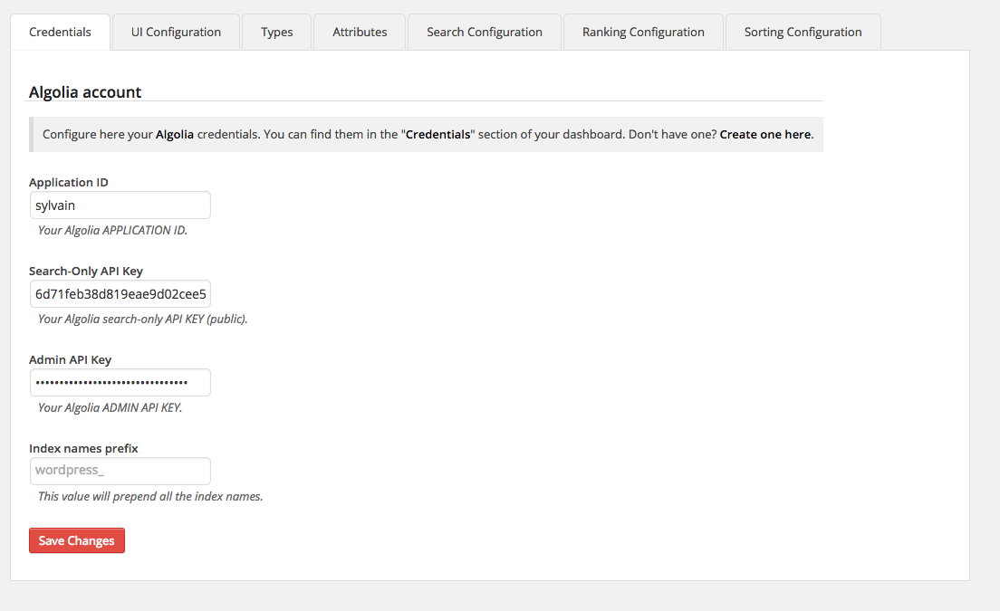
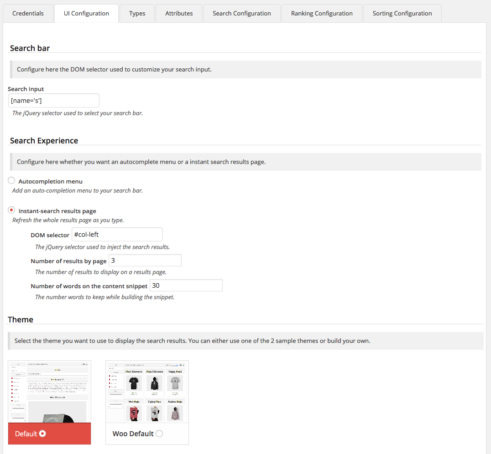
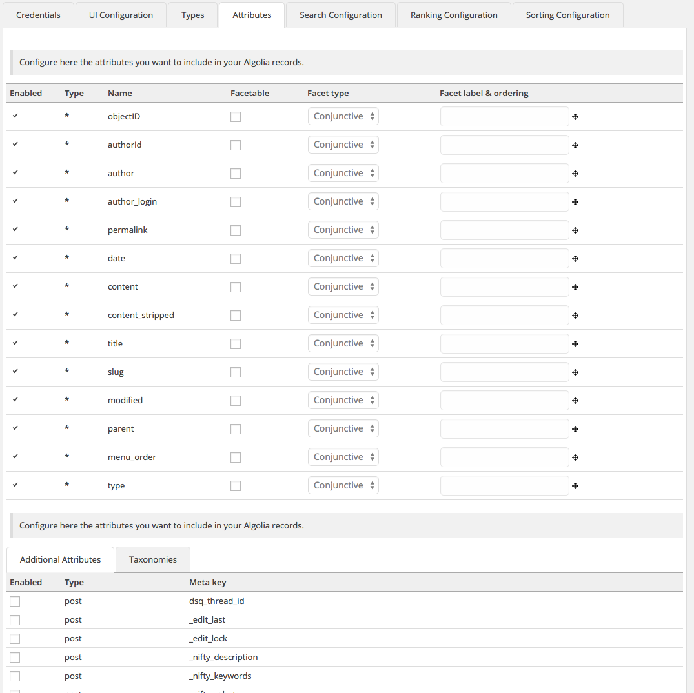
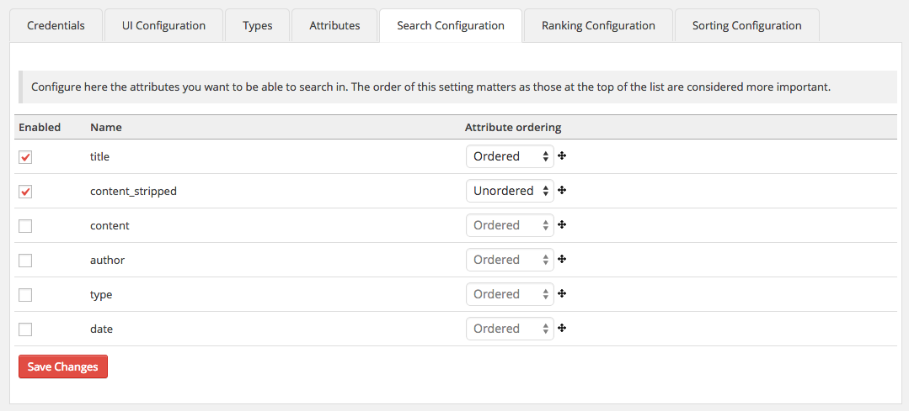

# Algolia Realtime Search Prestashop Plugin

[Algolia Search](http://www.algolia.com) is a hosted full-text, numerical, and faceted search engine capable of delivering realtime results from the first keystroke.

This plugin replaces the default search of Wordpress with an Algolia realtime search. It has been designed in a generic way to support plugins like WooCommerce in addition to the standard blog system.

## Installation

1. Create an Algolia account with [https://www.algolia.com/users/sign_up](https://www.algolia.com/users/sign_up)
2. Once logged in, go to the "Credential" section and get your Application ID & API keys
3. Install Algolia Prestashop Plugin:
  	- cd modules/
	- git clone https://github.com/algolia/algoliasearch-prestashop.git algolia
4. Activate the plugin through the Module menu in Prestashop
5. Go to the "Algolia Search" left menu configuration page and fill the your API keys
6. Configure the way Algolia is indexing your products, categories

## Configuration

### Credentials



In this section you configure two things:

   1. Your Application ID & API keys (credentials):

   You need to choose which api keys to use. You can go [https://www.algolia.com/licensing](https://www.algolia.com/licensing)

   2. Your index names prefix:

   The plugin will create several indices:

    * 1 index for the instant search
    * 2 index for autocompletion menu (1 for products, 1 for categories)
    * 1 (slave) index for each sort you enable

### UI Integration



#### Search Exprerience Configuration

   1. Search Bar

   To be able to trigger the search at each keystroke on your site you need to specify where the plugin is supposed to find the HTML search input. You do that by specifying a jQuery selector.

   In Prestashop's default theme it is: `[name='search_query']`

   2. Search Experience

   The plugin let you choose between two differents experience: an autocompletion menu or an instant search results page.

     * Autocompletion menu

      This experience adds an autocompletion menu to your search bar. In this menu you will have a section for every type you enable (page, post, ...) and one section for every taxonomy you enable (category, tag, ...).

      You need to specify the maximum number of result you want to display in each section.

      **Notes:** The types section will be displayed before the taxonomies one.

     * Instant search

     This experience refreshes the whole results page as you type. At each keystroke, the plugin refresh your whole search results page: including hits, facets & pagination.

     You need to indicate the jQuery DOM selector specifying where the plugin is supposed to put your results.

     You can also configure the number of results you want by page and the number of words included in the snippets.

#### Themes

The plugin supports themes which allow you to choose the way your results are displayed. You can choose one of the 2 sample themes or build your own one.

The theme is **totally independent** from the Prestashop theme. Each theme handles both Autocompletion **AND** Instant-search results page.

### Attributes



You can configure additional attribute or taxonomies you want to index. If you use Wordpress as a blog you should not have to change anything. When using Wordpress with plugin like WooCommerce this should be very useful as you probably want to index the `price` or the `total_sales` attributes as well.

When you enable an attribute, the plugin will add this attribute to the record but **it will not be searchable unless you enable it in the Search Configuration tab**.

When you make an attribute facetable **AND if you are in Instant Search Results Page mode** you will see a faceting/filtering bloc appears in which you can filter your results easily.

There is two facet types you can choose:

  1. Conjunctive

	  Your refinements on conjunctive facets are ANDed

  2. Disjunctive

	  Your refinements on conjunctive facets are ORed (e.g., hotels with 4 OR 5 stars)

Most translatable label for the attributes are handle direclty within prestashop, but some attribute does not have one so you need to add translated label to the 'traduction' javascript variable in the theme.js file of your theme

**Note:** A theme can add new facet types (sliders, tag clouds, ...).

### Search Configuration



For each attribute you enable, you can decide to make it searchable. If you do you can choose if you want the attribute ordered or unordered:

   1. Ordered

      Matches in attributes at the beginning of the list **will be** considered more important than matches in attributes further down the list. This setting is recommended for short attribute like `title`.

   2. Unordered

   Matches in attributes at the beginning of the list **will not be** considered more important than matches in attributes further down the list. This setting is recommended for long attribute like `content`/

**Notes:** If an attribute does not appear in this tab, be sure that you first enabled it on the <b>Attributes tab</b>.

### Results Ranking


For each attribute you enable, you can make them part of your custom ranking formula.

**Notes:** Attributes that you enable <b>NEED to been numerics</b>

### Sorting


For each attribute or taxonomy you enable you can select the ones you want to be able to sort with.

Enabling a new sort order will create a slave index with the exact same settings except the ranking formula will have the use the attribute you enable as the first ranking criterion. You can choose a label which will be displayed on the instant search result page.

## Build your theme

You can build your own search theme to make it look exactly like your current theme. The simplest way to do that is to copy one of the two default themes and work from there.  In most cases the only thing you will need to do is modify the `templates.php` file so that you can put you **own DOM/CSS elements to the template**.

**Notes:** Remember: there is no link between the Wordpress theme and the plugin theme.

### Folder architecture

A theme is composed by several **MANDATORY** files:

- `config.php`

	It should look like

	```php
	<?php

	return array(
      'name'                      => 'Woo Default',
      'screenshot'                => 'screenshot.png',
      'screenshot-autocomplete'   => 'screenshot-autocomplete.png'
      'facet_types'               => array()
	);
	```

	The name attribute will be displayed on the UI Page: it's your theme's name. And the screenshot and screenshot-autocomplete is the path of your instant search **AND** autocompletion menu screenshots (**relative to your theme root directory**).

- `styles.css`

  This file contains every CSS rule you need.

- `templates.php`

  This file contains all the HTML (we use Hogan.js) templates you need. The **mandory** content are:

  ```php
  <script type="text/template" id="autocomplete-template">
  /* Your autocomplete Hogan template HERE */
  </script>

  <script type="text/template" id="instant-content-template">
  /* Your instant search results Hogan template HERE */
  </script>

  <script type="text/template" id="instant-facets-template">
  /* Your facets template HERE */
  </script>

  <script type="text/template" id="instant-pagination-template">
    /* Your Pagination template HERE */
  </script>
  ```

- `theme.js`

  This file includes all the JS logic.


### Customize the `theme.js` file

You have access to the following things:

#### The `algoliaSettings` variable

This global JS variable contains every settings coming from the Wordpress back-end. It is defined on the AlgoliaPlugin.php as follow:

```php
$algoliaSettings = array(
            'app_id'                    => $this->algolia_registry->app_id,
            'search_key'                => $this->algolia_registry->search_key,
            'indices'                   => $indices,
            'sorting_indices'           => $sorting_indices,
            'index_name'                => $this->algolia_registry->index_name,
            'type_of_search'            => $this->algolia_registry->type_of_search,
            'instant_jquery_selector'   => str_replace("\\", "", $this->algolia_registry->instant_jquery_selector),
            'facets'                    => $facets,
            'number_by_page'            => $this->algolia_registry->number_by_page,
            'search_input_selector'     => str_replace("\\", "", $this->algolia_registry->search_input_selector),
            "plugin_url"                => $this->module->getPath(),
            "language"                  => $current_language,
            'theme'                     => $this->theme_helper->get_current_theme()
        );
```

#### The `engine` variable (defined in `front/main.js`)

You will have access to every function and attribute define in the `front/main.js`. You use the functions in this variable as a starting point to make your own or you can use it directly. Those function are the following:

**setHelper**: To use the engine you should set the AlgoliaSearchHelper at the beginning of your code

**updateUrl**: Save the refinements to the url

**getRefinementsFromUrl**: Load the refinements from the url and make a query with those refinements

**getFacets**:Make an object you can use to render your facets template

**getPages**:Make an object you can use to render your page template

**getHtmlForPagination**: Return the rendered hogan template for pagination

**getHtmlForResults**: Return the rendered hogan template for results

**getHtmlForFacets**: Return the rendered hogan template for facets

**gotoPage**: Set the current page when your are in instant search mode

**getDate**: A function that allow you to get a readable date from timestamp you can use like that in your hogan theme:

```html
{{#getDate}}{{date}}{{/getDate}}
```

**sortSelected**: A function that return "selected" if the parameter is equals to the current sort. You can use in that way in your hogan theme :

```html
<input {{#sortSelected}}name_of_the_index{{/sortSelected}} />
```

## FAQ

### What happens if I modify a setting from the Algolia dashboard?

The plugin tries to merge the settings that have been modified from the Algolia dashboard and the one generated from your plugin configuration. In every case the following settings will be erased:

1. For the autocompletion-menu
  * `attributesToIndex`

2. For the instant search results page
  * `attributesToIndex`
  * `attributesForFaceting`
  * `customRanking`
  * `slaves`
  * `ranking` (only for the sorting (slaves) indexes)

### I saved my configuration but I do not see any change on my results?

When you change a setting that impacts the index you may want to use the **Re-index data** button to reflect your changes in your Algolia index.
